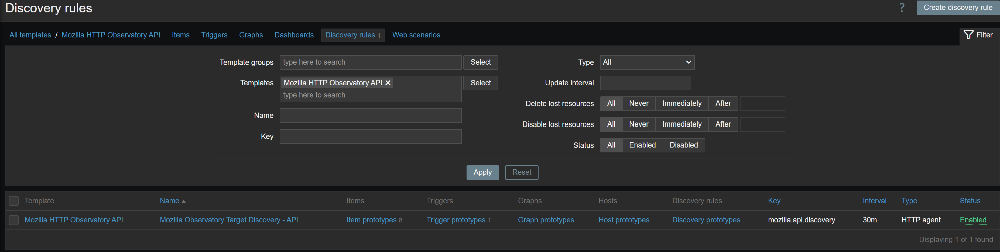
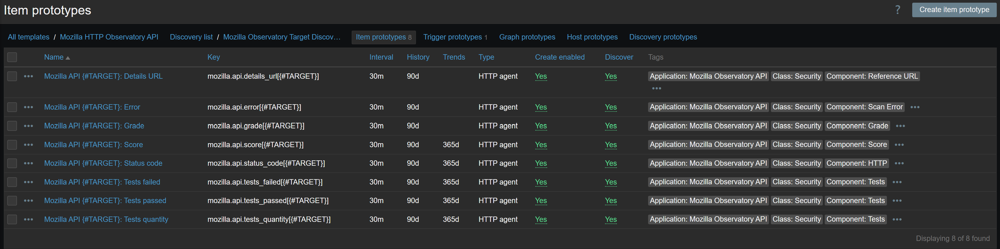
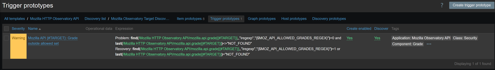

# Mozilla HTTP Observatory API Monitoring Template for Zabbix 7.4

[](https://www.zabbix.com/)
[](https://observatory.mozilla.org/)
[]()

**Author:** `://echo@dla.network [oZark oRChes✝ra✝'d]` | [](https://github.com/DLA-neTWorK)

**Version:** 1.0.0 (2026-04-21)

## Overview

Security-focused monitoring template for **Mozilla HTTP Observatory API** that brings continuous website hardening visibility into Zabbix. The template runs scheduled Observatory scans against explicit target hostnames and tracks grade drift, score trends, test outcomes, and API-level scan errors.

This is an **HTTP agent + LLD design** optimized for Zabbix 7.4 and NOC/SOC workflows where web security posture must be continuously monitored rather than checked ad hoc.

### Key Features

- ✅ **Automated Multi-Target Discovery** - Build one monitored entity per target from `{$MOZ_API_TARGETS}`
- ✅ **Live Observatory Scan Execution** - Every poll triggers Mozilla scan requests via API `POST /api/v2/scan`
- ✅ **Grade Compliance Alerting** - Regex-based policy trigger (`{$MOZ_API_ALLOWED_GRADES_REGEX}`) for flexible security baselines
- ✅ **Security Posture Telemetry** - Grade, score, status code, tests passed/failed/total, error text, details URL
- ✅ **Target Normalization & Deduplication** - JavaScript preprocessing cleans URLs/ports and removes duplicates automatically
- ✅ **NOC/SOC Friendly Triggering** - `manual_close=YES` for operational acknowledgement workflows
- ✅ **Zabbix 7.4 Native Pattern** - Uses LLD item/trigger prototypes with tag-rich metadata for filtering and correlation

---

## Monitoring Capabilities

### External Security Scan Monitoring (Mozilla API)

For each discovered target, the template collects:

- **Grade** (`A+` to `F`) for immediate compliance posture
- **Numeric Score** for trend analysis and KPI reporting
- **Tests Passed / Failed / Total** to quantify hardening quality
- **Status Code** returned in scan response context
- **Error Message** when scan execution fails or API reports an issue
- **Details URL** for direct drill-down to Observatory report output

### Discovery Intelligence

The LLD preprocessing pipeline:

- Accepts newline/comma/semicolon/space-separated target input
- Normalizes targets by removing protocol/path/query/fragment/port
- Converts hostnames to lowercase for consistency
- Eliminates duplicates before creating LLD entities
- Produces `{#TARGET}` and `{#TARGET_HOST}` macros per entry

---

## Visual References

### Low-Level Discovery Rule



### Item Prototypes



### Trigger Prototype



---

## Trigger Summary

### Trigger Prototypes (1 Total)

| Severity | Count | Trigger |
|----------|-------|---------|
| **WARNING** | 1 | `Mozilla API {#TARGET}: Grade outside allowed set` |

### Trigger Logic

- Fires when current grade does **not** match `{$MOZ_API_ALLOWED_GRADES_REGEX}`
- Default policy allows only `A+`, `A`, and `A-`
- Automatically suppresses missing/invalid grade state via `NOT_FOUND` handling
- Uses recovery expression to close when grade returns to allowed set (or `NOT_FOUND`)
- Includes `manual_close=YES` for incident lifecycle control

---

## Installation Guide

### Prerequisites

- ✅ Zabbix Server **7.4** or higher
- ✅ Outbound HTTPS connectivity from Zabbix server/proxy to:
  - `https://observatory-api.mdn.mozilla.net`
- ✅ DNS resolution for Mozilla API endpoints
- ✅ One or more public/reachable web targets to assess

### Step 1: Import Template

1. Download `7.4/template_mozilla_http_observatory.yaml`
2. Zabbix web interface -> **Configuration** -> **Templates** -> **Import**
3. Select the YAML file and complete import
4. Verify template name: **Mozilla HTTP Observatory API**

### Step 2: Create Host for Security Scans

1. **Configuration** -> **Hosts** -> **Create host**
2. **Host name:** Example `web-security-observatory`
3. **Groups:** Add to your security/website monitoring host group
4. **Interfaces:** No SNMP/agent interface required for this template
5. **Templates:** Link `Mozilla HTTP Observatory API`

### Step 3: Configure Required Macros

Set macros at host level (recommended) or template level:

| Macro | Default | Description |
|-------|---------|-------------|
| `{$MOZ_API_BASE}` | `https://observatory-api.mdn.mozilla.net` | Base URL for Mozilla Observatory API |
| `{$MOZ_API_TARGETS}` | `example.org` | Explicit target list (newline/comma/semicolon/space-separated) |
| `{$MOZ_API_ALLOWED_GRADES_REGEX}` | `^(A\+|A|A-)$` | Allowed-grade policy regex for alerting |

### Step 4: Define Target List Correctly

Important behavior:

- Targets must be **explicitly listed** (no wildcard expansion)
- `site.com`, `dev.site.com`, and `prod.site.com` are separate entries
- Input may include full URLs; preprocessing keeps only normalized host

Example:

```text
example.org
www.example.org
api.example.org
portal.example.net
```

### Step 5: Validate Data Collection

1. Go to **Monitoring** -> **Hosts** -> select scan host -> **Latest data**
2. Confirm discovery item `mozilla.api.discovery` is updating every 30m
3. Verify per-target items appear:
	- `mozilla.api.grade[{#TARGET}]`
	- `mozilla.api.score[{#TARGET}]`
	- `mozilla.api.tests_passed[{#TARGET}]`
	- `mozilla.api.tests_failed[{#TARGET}]`
	- `mozilla.api.tests_quantity[{#TARGET}]`
4. Confirm trigger behavior by temporarily tightening grade regex if needed

---

## Troubleshooting

### No Discovered Targets

**Symptoms:** No LLD entities or item prototypes created

**Checks:**
1. Validate `{$MOZ_API_TARGETS}` is set and non-empty
2. Ensure targets are valid hostnames after normalization
3. Confirm discovery interval elapsed (default: 30m)
4. Inspect latest value of `mozilla.api.discovery` for preprocessing errors

### Scan Errors Returned in Error Item

**Symptoms:** `mozilla.api.error[{#TARGET}]` contains non-`IDLE` text

**Checks:**
1. Verify target is publicly reachable from Mozilla scanning infrastructure
2. Check hostname correctness and DNS validity
3. Re-run after some time in case of transient API/service conditions
4. Confirm no malformed targets were entered (scheme/path/query are removed, but invalid hosts still fail)

### Grade is `NOT_FOUND`

**Symptoms:** Grade item shows `NOT_FOUND`

**Meaning:** API did not return a usable grade in current response context

**Checks:**
1. Review `mozilla.api.error[{#TARGET}]` for root cause
2. Open `mozilla.api.details_url[{#TARGET}]` value if present
3. Ensure target is eligible for Observatory evaluation

### Frequent Alerts for Acceptable Grades

**Symptoms:** Trigger fires despite your policy intent

**Fix:** Update `{$MOZ_API_ALLOWED_GRADES_REGEX}` to your accepted baseline.

Examples:

```text
# Strict (default): A+, A, A-
^(A\+|A|A-)$

# Moderate: allow B range too
^(A\+|A|A-|B\+|B|B-)$

# Broad: allow C and above
^(A\+|A|A-|B\+|B|B-|C\+|C|C-)$
```

### API Connectivity Failures

**Symptoms:** All API-based items become unsupported/time out

**Checks:**
1. Test outbound connectivity from Zabbix server/proxy:
	```bash
	curl -I https://observatory-api.mdn.mozilla.net/api/v2/scan
	```
2. Verify firewall/proxy policy permits outbound HTTPS
3. Check DNS resolution for `observatory-api.mdn.mozilla.net`
4. Review Zabbix server/proxy logs for HTTP agent errors and timeouts

---

## Technical Architecture

### Monitoring Method

| Method | Purpose | Item Type | Advantages | Notes |
|--------|---------|-----------|------------|-------|
| **Mozilla Observatory API** | Web security posture scanning | HTTP agent (POST) | Real-world security grade and test feedback | External dependency on Mozilla service availability |

### Data Collection Flow

```text
┌──────────────────────────────────────────────────────────────┐
│                 Zabbix Server/Proxy 7.4                     │
│  ┌────────────────────────────────────────────────────────┐  │
│  │ LLD Rule: mozilla.api.discovery (every 30m)           │  │
│  │ - Reads {$MOZ_API_TARGETS}                            │  │
│  │ - Normalizes and deduplicates hostnames               │  │
│  │ - Creates one entity per {#TARGET}                    │  │
│  └───────────────────────────┬────────────────────────────┘  │
│                              │                               │
│                              ▼                               │
│  ┌────────────────────────────────────────────────────────┐  │
│  │ Item Prototypes (8 per discovered target, every 30m)  │  │
│  │ - Grade / Score / Status code                         │  │
│  │ - Tests passed / failed / total                       │  │
│  │ - Error / Details URL                                 │  │
│  └───────────────────────────┬────────────────────────────┘  │
└──────────────────────────────┼───────────────────────────────┘
										 │ HTTPS
										 ▼
			 Mozilla Observatory API (POST /api/v2/scan?host=TARGET)
```

### Discovery and Item Statistics

| Object Type | Count |
|-------------|-------|
| LLD rules | 1 |
| Item prototypes per target | 8 |
| Trigger prototypes per target | 1 |
| Host-level macros | 3 |

### Polling and Retention

| Metric Group | Update Interval | History |
|--------------|-----------------|---------|
| Discovery | 30m | 30d (entity lifetime) |
| Target security metrics | 30m | 90d |

---

## Use Cases

### Web Security Baseline Enforcement
- Ensure every internet-facing site stays within approved grade policy
- Detect hardening regressions after deployment/configuration changes

### SOC/NOC Security Monitoring
- Route grade policy violations into operational incident workflows
- Use `manual_close` to track acknowledgement and remediation ownership

### Compliance and Audit Readiness
- Keep historical score/test trends for security review cycles
- Provide objective third-party scan evidence from Mozilla Observatory

### Multi-Environment Governance
- Monitor production, staging, and edge domains in one template
- Apply different allowed-grade regex policies per host/group when needed

---

## Version History

### v1.0.0 - Initial Release Documentation (2026-04-21)

- ✅ Added enterprise-style README for Zabbix 7.4 template
- ✅ Documented architecture, macros, discovery behavior, and trigger policy model
- ✅ Added troubleshooting guidance for API/error/grade edge cases
- ✅ Added operational references for LLD, item prototypes, and trigger prototypes

---

## Support & Resources

### Template Maintainer

**Author:** `://echo@dla.network [oZark oRChes✝ra✝'d]` | [](https://github.com/DLA-neTWorK)

For template improvements, tuning requests, or issue reports, contact the maintainer.

### Mozilla Resources

- [Mozilla Observatory](https://observatory.mozilla.org/)
- [Mozilla Observatory API](https://observatory-api.mdn.mozilla.net/api/v2)
- [Mozilla Developer Network (MDN)](https://developer.mozilla.org/)

### Zabbix Resources

- [Zabbix 7.4 Documentation](https://www.zabbix.com/documentation/7.4/)
- [HTTP Agent Items](https://www.zabbix.com/documentation/7.4/manual/config/items/itemtypes/http)
- [Low-Level Discovery (LLD)](https://www.zabbix.com/documentation/7.4/manual/discovery/low_level_discovery)
- [Trigger Prototypes](https://www.zabbix.com/documentation/7.4/en/manual/discovery/low_level_discovery/trigger_prototypes)
- [JavaScript Preprocessing](https://www.zabbix.com/documentation/7.4/manual/config/items/preprocessing/javascript)

### Community

- [Zabbix Share Templates](https://share.zabbix.com/)
- [Zabbix Community Forum](https://www.zabbix.com/forum/)
- [GitHub - Zabbix](https://github.com/zabbix)

---

## License & Attribution

This template is provided for community use in web security monitoring scenarios.

**License:** Community template - free to use, modify, and distribute  
**Attribution:** Please retain author attribution when sharing or modifying  
**Third-Party Service Attribution:** Security scan data is sourced from Mozilla HTTP Observatory API

---

## Quick Reference

### Template Metadata

| Property | Value |
|----------|-------|
| **Template Name** | Mozilla HTTP Observatory API |
| **Template Group** | Security SCANS |
| **Zabbix Version** | 7.4+ |
| **Monitoring Type** | HTTP Agent API |
| **Vendor Tag** | mozilla |
| **Domain Tag** | web-security |

### Key Items per Target

| Item | Key |
|------|-----|
| Grade | `mozilla.api.grade[{#TARGET}]` |
| Score | `mozilla.api.score[{#TARGET}]` |
| Status code | `mozilla.api.status_code[{#TARGET}]` |
| Tests passed | `mozilla.api.tests_passed[{#TARGET}]` |
| Tests failed | `mozilla.api.tests_failed[{#TARGET}]` |
| Tests quantity | `mozilla.api.tests_quantity[{#TARGET}]` |
| Error | `mozilla.api.error[{#TARGET}]` |
| Details URL | `mozilla.api.details_url[{#TARGET}]` |

### Macro Quick Reference

```text
{$MOZ_API_BASE}=https://observatory-api.mdn.mozilla.net
{$MOZ_API_TARGETS}=example.org
{$MOZ_API_ALLOWED_GRADES_REGEX}=^(A\+|A|A-)$
```

### API Test Command

```bash
# Run one manual scan request
curl -X POST "https://observatory-api.mdn.mozilla.net/api/v2/scan?host=example.org"
```

---

**Template Type:** Security Monitoring (Web Hardening)  
**Monitoring Method:** Mozilla Observatory API via HTTP agent  
**Zabbix Version:** 7.4+  
**Last Updated:** April 21, 2026

---

*Designed for continuous web security posture monitoring with policy-driven alerting and target-level observability.*
